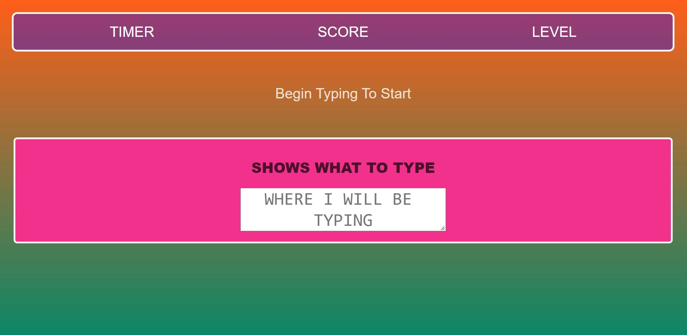

# therapeutic-typing

   

## Description
Designed a therapeutic typing game for individuals of all ages to enjoy and build typing skills.

## Table Of Contents
* [Links](#links)

* [Instructions](#instructions)

* [Screenshots](#screenshots)

* [License](#license)

## Links
[Git Repo](https://github.com/asantercureton/therapeutic-typing)

<!-- [Heroku Link]() -->

## Instructions
Follow in-game prompts

## Screenshots
Below is a screenshot of the project:

## License

---
© 2022 CCure Coaching, Arts & Apparel.